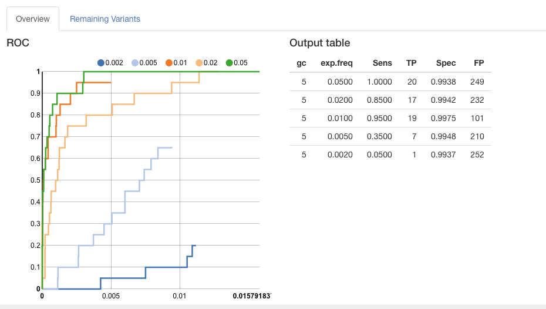

```{r setup, include=FALSE}
knitr::opts_chunk$set(echo = FALSE)
```

## Background

* We are interested in within host diversity of influenza virus (RNA genome).
  * Translation : We do a lot of sequencing of viral swabs, and look for single nucleotide variants present at various frequencies *within a single person*


## Motivation : What is the accuracy of our method?

<div class="centered">


</div>


## Experimental set up
<div class="centered">


</div>


## Initial Accuracy


<div class="centered">

</div>


## Many variables

* Whether or not to include PCR duplicate reads
* Which p value correction method to use (Bonferroni or Benjamini Hochberg)
* Should the DeepSNV error model be a binomial model or a beta binomial.
* If beta binomial should the test be one sided or two sided (two sided is recommend with large amounts of PCR amplification) 
* What p value threshold to use
* What mapping quality threshold to apply (if any)
* What Phred score threshold to apply (if any)
* What read position threshold should be applied (if any)
* What frequency threshold to apply (if any)
* Should only the coding regions be included in analysis
* Should the ends of the genomic segments be excluded from analysis (if so how much should be trimmed)


## Shiny app!

```{r,eval=T}
shinyAppDir(appDir = "~/Desktop/benchmarking_shiny/20_mut_data_set/",options = list(width="110%",height="100%"))
```


## What is Shiny

<div class="centered">
"A web application framework for R

Turn your analyses into interactive web applications

No HTML, CSS, or JavaScript knowledge required"

http://shiny.rstudio.com

</div>


## Example

```{r, echo = FALSE}
shinyApp(
  
  ui = bootstrapPage(

  selectInput(inputId = "n_breaks",
      label = "Number of bins in histogram (approximate):",
      choices = c(10, 20, 35, 50),
      selected = 20),

  checkboxInput(inputId = "individual_obs",
      label = strong("Show individual observations"),
      value = FALSE),

  checkboxInput(inputId = "density",
      label = strong("Show density estimate"),
      value = FALSE),

  plotOutput(outputId = "main_plot", height = "300px"),

  # Display this only if the density is shown
  conditionalPanel(condition = "input.density == true",
    sliderInput(inputId = "bw_adjust",
        label = "Bandwidth adjustment:",
        min = 0.2, max = 2, value = 1, step = 0.2)
  )

),
  
  server = function(input, output) {
      output$main_plot <- renderPlot({

    hist(faithful$eruptions,
      probability = TRUE,
      breaks = as.numeric(input$n_breaks),
      xlab = "Duration (minutes)",
      main = "Geyser eruption duration")

    if (input$individual_obs) {
      rug(faithful$eruptions)
    }

    if (input$density) {
      dens <- density(faithful$eruptions,
          adjust = input$bw_adjust)
      lines(dens, col = "blue")
    }

  })
},
  options = list(height = 500)
)


```


## Shiny Application Architecture

Two chunks of code

1) UI - user interface - controls the layout of the app
2) Server - R script - code that runs the analysis and populates the plots

* Usually two separate files stored in the same directory
* Communicate through **input\$**  and **output\$**

## ui.R

```{r,eval=F,echo=T}
bootstrapPage( # Page layout

  ## Input values 
  selectInput(inputId = "n_breaks",  # name of the input  - for reference in server.R
      label = "Number of bins in histogram (approximate):", # label to be displayed on ui
      choices = c(10, 20, 35, 50), # Input specific options
      selected = 20), # starting value

  checkboxInput(inputId = "individual_obs",
      label = strong("Show individual observations"),
      value = FALSE),

  checkboxInput(inputId = "density",
      label = strong("Show density estimate"),
      value = FALSE),

  # Output plot from server.R
  plotOutput(outputId = "main_plot", height = "300px"),

  # Display this only if the density is shown
  conditionalPanel(condition = "input.density == true",  # An extra conditional panel
    sliderInput(inputId = "bw_adjust", # name of the input  - for reference in server.R
        label = "Bandwidth adjustment:", # label to be displayed on ui
        min = 0.2, max = 2, value = 1, step = 0.2) # Input specific options with starting value
  )

)

```


## selectInput

```{r,eval=F,echo=T}
  ## Input values 
  selectInput(inputId = "n_breaks",  # name of the input  - for reference in server.R
      label = "Number of bins in histogram (approximate):", # label to be displayed on ui
      choices = c(10, 20, 35, 50), # Input specific options
      selected = 20), # starting value

```


<div class="centered">

</div>


## checkboxInput

```{r,eval=F,echo=T}
  ## Input values 
  checkboxInput(inputId = "individual_obs",
      label = strong("Show individual observations"),
      value = FALSE),


```


<div class="centered">

</div>

## Conditional sliderInput

```{r,eval=F,echo=T}
  checkboxInput(inputId = "density",
      label = strong("Show density estimate"),
      value = FALSE),
  # Display this only if the density is shown
  conditionalPanel(condition = "input.density == true",  # An extra conditional panel
    sliderInput(inputId = "bw_adjust", # name of the input  - for reference in server.R
        label = "Bandwidth adjustment:", # label to be displayed on ui
        min = 0.2, max = 2, value = 1, step = 0.2) # Input specific options with starting value
  )
```


<div class="centered">

</div>

## Basic inputs

```{r}
shinyApp(
  ui= fluidPage(
  #titlePanel("Basic widgets"),
  
  fluidRow(
    
    column(3,
      h3("Buttons"),
      actionButton("action", label = "Action"),
      br(),
      br(), 
      submitButton("Submit")),
    
    column(3,
      h3("Single checkbox"),
      checkboxInput("checkbox", label = "Choice A", value = TRUE)),
    
    column(3, 
      checkboxGroupInput("checkGroup", 
        label = h3("Checkbox group"), 
        choices = list("Choice 1" = 1, 
           "Choice 2" = 2, "Choice 3" = 3),
        selected = 1)),
    
    column(3, 
      dateInput("date", 
        label = h3("Date input"), 
        value = "2014-01-01"))   
  ),
  
  fluidRow(
    
    column(3,
      dateRangeInput("dates", label = h3("Date range"))),
    
    column(3,
      fileInput("file", label = h3("File input"))),
    
    column(3, 
      h3("Help text"),
      helpText("Note: help text isn't a true widget,", 
        "but it provides an easy way to add text to",
        "accompany other widgets.")),
    
    column(3, 
      numericInput("num", 
        label = h3("Numeric input"), 
        value = 1))   
  ),
    
  fluidRow(
    
    column(3,
      radioButtons("radio", label = h3("Radio buttons"),
        choices = list("Choice 1" = 1, "Choice 2" = 2,
                       "Choice 3" = 3),selected = 1)),
    
    column(3,
      selectInput("select", label = h3("Select box"), 
        choices = list("Choice 1" = 1, "Choice 2" = 2,
                       "Choice 3" = 3), selected = 1)),
    
    column(3, 
      sliderInput("slider1", label = h3("Sliders"),
        min = 0, max = 100, value = 50),
      sliderInput("slider2", "",
        min = 0, max = 100, value = c(25, 75))
      ),
    
    column(3, 
      textInput("text", label = h3("Text input"), 
        value = "Enter text..."))   
  )

),
server=function(input, output) {}
)

```


## Basic outputs

Command                      Produces       
-----------                 ---------
htmlOutput	                  raw HTML
imageOutput	                  image
plotOutput	                   plot
tableOutput	                  table
textOutput	                   text
uiOutput	                     raw HTML
verbatimTextOutput          	text


## server.R

```{r,eval=F,echo=T}
function(input, output) {
      output$main_plot <- renderPlot({ # populates plotOutput(outputId = "main_plot", height = "300px")

    hist(faithful$eruptions,
      probability = TRUE,
      breaks = as.numeric(input$n_breaks), # from - selectInput(inputId = "n_breaks",
      xlab = "Duration (minutes)",
      main = "Geyser eruption duration")

    if (input$individual_obs) { # from - checkboxInput(inputId = "individual_obs",
      rug(faithful$eruptions)
    }

    if (input$density) { # from checkboxInput(inputId = "density",
      dens <- density(faithful$eruptions,
          adjust = input$bw_adjust)     # from - conditionalPanel(condition = "input.density == true",  
            lines(dens, col = "blue")   #         sliderInput(inputId = "bw_adjust",
      
    }

  })
}

```

## Building reactive outputs
```{r,eval=F,echo=T}
 reactive.df<-reactive({
   ## code that involves some input$ that will be rerun each time the input changes
 })
```
Command                      Produces       
-----------                 ---------
renderImage	                  images (saved as a link to a source file)
renderPlot                  	plots
renderPrint	                  any printed output
renderTable	                  data frame, matrix, other table like structures
renderText	                  character strings
renderUI                    	a Shiny tag object or HTML

## Server.R - another look

```{r,eval=F,echo=T}
function(input, output) {
  ##<b>   
   output$main_plot <- renderPlot({ # populates plotOutput(outputId = "main_plot", height = "300px")
  ##</b>
    hist(faithful$eruptions,
      probability = TRUE,
      breaks = as.numeric(input$n_breaks), # from - selectInput(inputId = "n_breaks",
      xlab = "Duration (minutes)",
      main = "Geyser eruption duration")

    if (input$individual_obs) { # from - checkboxInput(inputId = "individual_obs",
      rug(faithful$eruptions)
    }

    if (input$density) { # from checkboxInput(inputId = "density",
      dens <- density(faithful$eruptions,
          adjust = input$bw_adjust)     # from - conditionalPanel(condition = "input.density == true",  
            lines(dens, col = "blue")   #         sliderInput(inputId = "bw_adjust",
      
    }

  })
}

```

## My Shiny app  - ui.R 

<div class="centered">




</div>


## My Shiny app  - ui.R 


```{r,echo=T,eval=F}

shinyUI(fluidPage(
  titlePanel("Benchmarking variant caller"), # Main title
  tabsetPanel( # make mulitple tabs
  
      tabPanel("Overview", #first tab title
        ##<b>
        fluidRow( # split first tab by fluidRows (must sum to 12)
        column(6,  # This makes a column that takes up half the page
               h4("ROC"), # title
               showOutput("myChart", "nvd3")), # display rchart output
        column(6, # the other half
               h4("Output table"),
               tableOutput('table'))
      ),
      ##</b>
      hr(), # horizontal line
```

## ui.R - Inputs

<div class="centered">


</div>


## ui.R Inputs

```{r,echo=T,eval=F}
fluidRow(
        column(3,     # Here I have 4 columns of equal width 3 X 4 =12
               sliderInput(inputId = "MapQ",  # slider input for MapQ
                            label = "Mean MapQ cutoff",
                            min=0,max=42,value=0),
               sliderInput(inputId = "Phred",   
                           label = "Mean Phred cutoff",
                           min=30,max=42,value=30),
               
               numericInput(inputId = "freq.var",  # numerical input for frequency cutoff
                            label = "Frequency cutoff",
                            value=0),
               numericInput(inputId = "p.val",
                            label = "p value cutoff",
                            value=0.01)
        ),
    
```

## ui.R Second tab
<div class="centered">


</div>


## ui.R Second tab

```{r,echo=T,eval=F}
tabPanel("Remaining Variants", # The second tab with graphs of the remaining variants
             fluidRow(
               column(12, # only 1 column here
                      #plotOutput("samp.dis"),
                      ##<b>
                      plotOutput("freq"),
                      plotOutput("mean.pos"),
                      plotOutput("mean.qual")
                      ##</b>
                      #plotOutput("mean.mapq"),
                      #plotOutput("position")
                      
                )
             )  
    )

```

## server.R - reading in data

```{r,echo=T,eval=F}
shinyServer(function(input, output) {
  ## <b>
  dataInput<-reactive({  #### changes to data used ##########
    criteria<-paste0(input$dups,".*",input$method,".*",input$disp,".*","sum.csv$")
    file<-list.files(path = "~/Desktop/benchmarking_shiny/20_mut_data_set/processed_data",pattern = criteria,full.names = T)
    print(file)

    sum.df.raw<-read.csv(file,comment.char='#',stringsAsFactors = F)
    print(names(sum.df.raw))
    return(sum.df.raw)
  })
  ##</b>
 data.c<-reactive({
    sum.df<-dataInput()
    if(input$coding==T){
      
      sum.df<-ddply(sum.df,~chr,coding.cut)
      return(sum.df)
    }else{
      return(sum.df)
    }
  })
  
  
```


## server.R - subsetting and ROC curve

```{r,eval=F,echo=T}
output$myChart <- renderChart2({
    ##<b>
    sum.df<-data() # get data
    possible_vars<-possible.vars() # get possible_vars from reactive
    #subset data based on input
    cut.df<-subset(x=sum.df,MapQ>input$MapQ & Phred>input$Phred & gc==input$gc_roc & freq.var>input$freq.var& Read_pos<=input$pos[2] & Read_pos>=input$pos[1]& exp.freq %in% input$exp.freq) 
 ##</b>
    h.roc.df<-hiseq.roc(cut.df,20,possible_vars,">") # make ROC data frame
    #format data frame for plotting
    r_plot<-h.roc.df[order(h.roc.df$adj.specificity,decreasing = T),]
    r_plot<-mutate(r_plot,FDR=1-adj.specificity,threshold=format(threshold,scientific=T,digits=3))
    r_plot<-mutate(r_plot, gc = paste0("10^",sub(pat,"\\1",samp)))
    print(head(r_plot))
    
    #### make rchart ####
    rp <- nPlot(adj.sensitivity~FDR, group=c("exp.freq"), data = r_plot, type = "lineChart")
    rp$params$width = 450
    rp$params$height = 450
    rp$chart(forceX = c(0,0.005))
    rp$chart(forceY = c(0,1))
    rp$chart(tooltipContent = "#! function(key, x, y, e){
  return '<b>P=</b>: ' + e.point.threshold + 
  '<b> FP</b>: '+e.point.FP+ '<b> TP</b>: '+e.point.TP
} !#")
    rp$yAxis( axisLabel = "Sensitivity" )
    rp$xAxis( axisLabel = "1-Specificity")
    rp
  })
```

## Shiny 

* Straightforward means of producing interactive graphs using only R code
  * No HTML,css,javascript required
* Allows one to interact with the data on all levels
* Requires an active R session
* Great tutorials available 
* Well documented

## Other means of interactivity in R
* Produce interactive HTML plots that can stand alone - No R session needed
* Less powerful than Shiny

## rcharts
* R code => javascript charts
* Support base and lattice style plots
* Easy to share/embed 
* OK documentation -http://rcharts.io


## Example

```{r, echo=T,eval=F}
library(rCharts)
hair_eye_male <- subset(as.data.frame(HairEyeColor), Sex == "Male")
n1 <- nPlot(Freq ~ Hair, group = "Eye", data = hair_eye_male, type = "multiBarChart")
n1
```


<iframe src="./assets/img/examplerchart.html"></iframe>

## Plotly

* My new favorite
* Very easy to plot ggplot2 style plots
* Well documented

## Plotly example
```{r,message=F,warning=F,echo=T,fig.height=3.7}
require(plotly)
require(ggplot2)
hair_eye_male <- subset(as.data.frame(HairEyeColor), Sex == "Male")
example<-ggplot(hair_eye_male,aes(y=Freq,x=as.factor(Hair),fill=Eye))+geom_bar(stat="identity",position='dodge')+xlab("Hair Color")+ylab("Count")

example
```


## Plotly example (cont.)
```{r,echo=T}
ggplotly(example)
```

## In conclusion 

1) Shiny
  * Very powerful
  * Alter all aspects of data and plots
  * Well documented
  * Requires an active R session
2) rCharts & Plotly
  * Less powerful
  * Provide a different form of interactivity
  * Less documented but getting there
  * produce stand alone html 

## Questions?

* https://github.com/jtmccr1/DANG_5_31_2016
* http://lauringlab.github.io/benchmarking_shiny/
